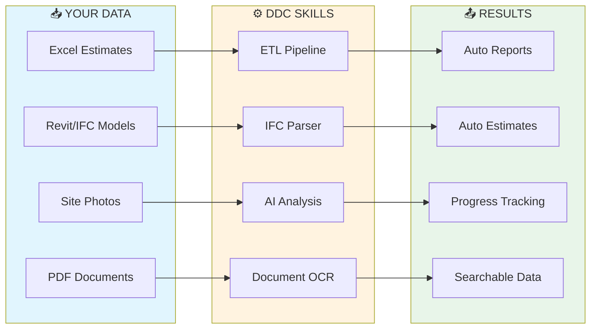
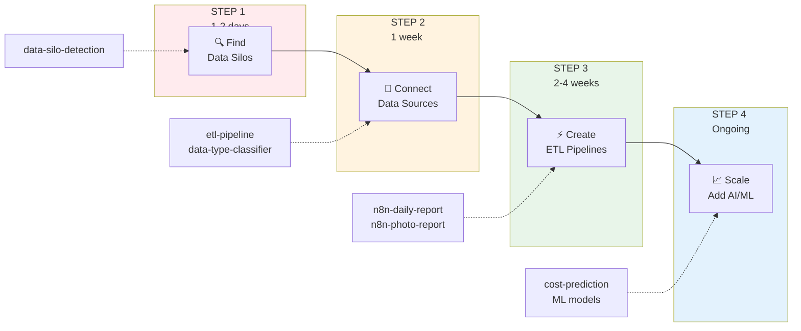
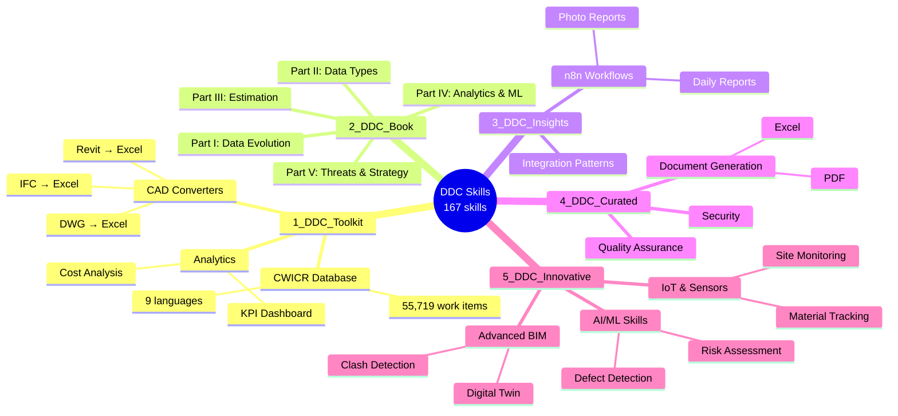
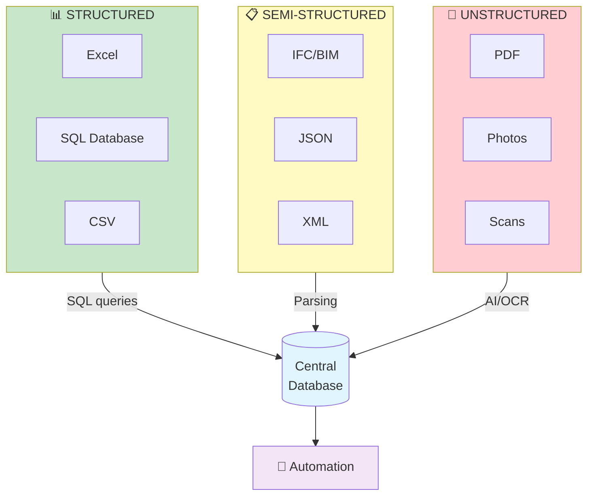
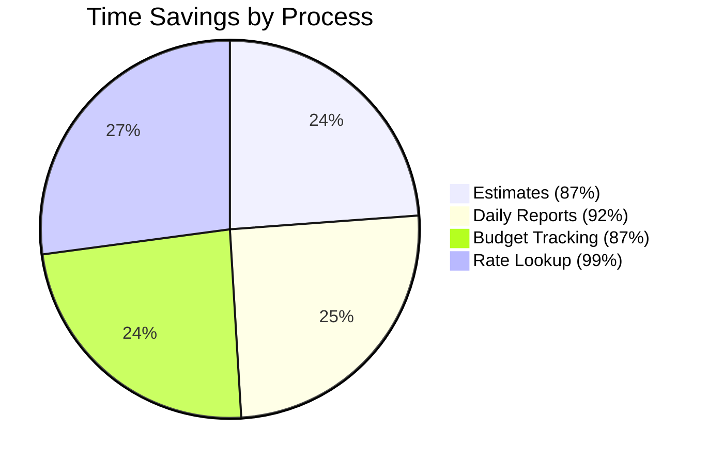

# DDC Skills Collection for AI Coding Assistants

**AI Tools for Construction Company Automation**

> *"ETL: transitioning from manual to automated management allows companies to process data without constant human intervention."* — Data-Driven Construction, Chapter 4.2

### Works with any AI coding assistant:
`Claude Code` · `Cursor` · `GitHub Copilot` · `Gemini Code Assist` · `Cody` · `Continue` · `OpenCode` · `Aider`

---

## What is this?

A collection of **167 ready-to-use skills** for automating construction company processes with AI.



---

## Who is this for?

| Role | What you get | Start with |
|------|--------------|------------|
| **Executive** | Understanding how to automate your company | [GETTING_STARTED.md](GETTING_STARTED.md) |
| **Estimator** | Automated estimate creation | `estimate-builder`, `semantic-search-cwicr` |
| **PM / Superintendent** | Automatic reports | `n8n-daily-report`, `n8n-photo-report` |
| **IT / Developer** | Ready Python scripts and APIs | Any skill from `2_DDC_Book/` |

---

## How does it work?



---

## Collection Structure



---

## Data Types in Construction



---

## Top 10 Skills to Start

| # | Skill | What it does | Time savings |
|---|-------|--------------|--------------|
| 1 | `semantic-search-cwicr` | Search 55,719 work items database | 99% (15 min → 10 sec) |
| 2 | `etl-pipeline` | Automated Excel/PDF processing | 80% |
| 3 | `estimate-builder` | Build estimates from data | 87% |
| 4 | `n8n-daily-report` | Automated daily reports | 92% |
| 5 | `data-silo-detection` | Find isolated data sources | - |
| 6 | `ifc-to-excel` | Extract quantities from BIM | 90% |
| 7 | `n8n-photo-report` | AI-powered site photo analysis | 83% |
| 8 | `cost-prediction` | ML cost forecasting | - |
| 9 | `schedule-delay-analyzer` | Schedule variance analysis | 87% |
| 10 | `kpi-dashboard` | Project KPI dashboard | 75% |

---

## Quick Start

### 1. Installation

```bash
pip install pandas openpyxl ifcopenshell pdfplumber qdrant-client
```

### 2. Example: Search Work Items

```python
# Instead of 15 minutes searching manuals → 10 seconds

from qdrant_client import QdrantClient

client = QdrantClient("localhost", port=6333)
results = client.search(
    collection_name="ddc_cwicr_en",
    query_vector=get_embedding("concrete foundation pour"),
    limit=5
)

# Result:
# [{'code': '03.30.00', 'description': 'Concrete works - foundations', 'unit': 'm³'}]
```

### 3. Example: ETL Pipeline

```python
# Automatic processing of all Excel files from folder

import pandas as pd
from pathlib import Path

# Extract
all_data = [pd.read_excel(f) for f in Path("./estimates/").glob("*.xlsx")]
df = pd.concat(all_data)

# Transform
df['Total'] = df['Quantity'] * df['Unit_Price']
summary = df.groupby('Category')['Total'].sum()

# Load
summary.to_excel("summary_report.xlsx")
```

### 4. Example: Automated Report (n8n)


---

## Documentation

| Document | Description | Audience |
|----------|-------------|----------|
| [**GETTING_STARTED.md**](GETTING_STARTED.md) | Step-by-step automation guide | Executives, beginners |
| [OPTIMIZER_GUIDE.md](OPTIMIZER_GUIDE.md) | How to work effectively with Claude | Developers |
| [IMPROVEMENT_ROADMAP.md](IMPROVEMENT_ROADMAP.md) | Collection development plan | Contributors |

---

## Folder Structure

```
DDC_Skills/
│
├── 1_DDC_Toolkit/              ← Production tools (85 skills)
│   ├── CWICR-Database/         ← 55,719 work items database
│   ├── CAD-Converters/         ← Revit/IFC/DWG → Excel
│   └── ...
│
├── 2_DDC_Book/                 ← Skills from the book (50 skills)
│   ├── Chapter-1.1/            ← Data evolution
│   ├── Chapter-1.2/            ← Data silos
│   ├── Chapter-2.1/            ← Data types
│   ├── Chapter-4.2/            ← ETL pipelines
│   └── ...
│
├── 3_DDC_Insights/             ← Practical workflows (5 skills)
│   └── Automation-Workflows/   ← n8n automation
│
├── 4_DDC_Curated/              ← External skills (5 skills)
│   ├── Document-Generation/    ← PDF/Excel generation
│   └── Quality-Assurance/      ← Quality checks
│
├── 5_DDC_Innovative/           ← Advanced AI/ML skills (22 skills)
│   ├── defect-detection-ai/    ← Computer vision for defects
│   ├── digital-twin-sync/      ← Real-time BIM sync
│   └── ...
│
├── GETTING_STARTED.md          ← START HERE
└── README.md                   ← You are here
```

---

## ROI of Automation



### Example Use Cases

| Process | Before | After |
|---------|--------|-------|
| Create estimate | 2 days manual work | 2 hours with ETL |
| Daily report | 2 hours collecting data | 10 min auto-generated |
| Find work item rate | 15 min searching manuals | 10 sec semantic search |
| Budget variance check | Weekly manual review | Real-time alerts |
| IFC quantity takeoff | Manual measurement | Automatic extraction |
| Subcontractor comparison | Spreadsheet analysis | AI-powered matching |
| Site photo documentation | Manual sorting & tagging | CV auto-classification |
| Schedule delay detection | Monthly review meetings | Predictive alerts |
| Document classification | Manual filing | NLP auto-categorization |
| Cost forecasting | Expert intuition | ML prediction models |

*These are just a few examples. See [GETTING_STARTED.md](GETTING_STARTED.md) for complete automation scenarios.*

---

## Resources

| Resource | Link |
|----------|------|
| Book | "Data-Driven Construction" by Artem Boiko (ISBN 978-3-9826255-9-1) |
| Website | https://datadrivenconstruction.io |
| CWICR Demo | https://openconstructionestimate.com |
| GitHub | https://github.com/datadrivenconstruction |
| CWICR Database | https://github.com/datadrivenconstruction/OpenConstructionEstimate-DDC-CWICR |
| CAD2Data Pipeline | https://github.com/datadrivenconstruction/cad2data-Revit-IFC-DWG-DGN-pipeline-with-conversion-validation-qto |

---

## License

- **CWICR Database**: CC BY 4.0
- **DDC Tools**: MIT License
- **Skills**: MIT License

---

**Start automation today → [GETTING_STARTED.md](GETTING_STARTED.md)**
