<h1 align="center">DDC Skills Collection for AI Coding Assistants</h1>

<p align="center">
  <strong>AI Tools for Construction Company Automation</strong>
</p>

<p align="center">
  
  
  
  
</p>

<p align="center"></p>

<h3 align="center">Works with any AI coding assistant:</h3>

<p align="center">
  <a href="https://claude.ai/download"></a>
  <a href="https://antigravity.google/"></a>
  <a href="https://github.com/nicepkg/opencode"></a>
  <a href="https://github.com/clawdbot/clawdbot"></a>
</p>

---

## What is this?

A collection of **221 skills** for automating construction company processes with AI coding assistants.

### What is a "Skill"?

A skill is a `SKILL.md` file — structured instructions that an AI coding assistant can read and execute. Each skill describes a specific task: what problem it solves, what code to generate, and what tools are needed. You open a skill folder in your AI assistant, and it helps you implement the described functionality.

---

## Collection Structure

Skills are organized by source and complexity level:

| Category | What's inside | Skills | Start here if... |
|----------|---------------|--------|------------------|
| **1_DDC_Toolkit** | Production-ready tools: CWICR database, CAD converters, analytics | 85 | You need a working tool now |
| **2_DDC_Book** | Skills mapped to book chapters: data evolution, types, estimation, ML | 67 | You want to follow a structured learning path |
| **3_DDC_Insights** | Practical workflows: n8n automation, AI agents, field tools | 20 | You need workflow automation |
| **4_DDC_Curated** | Document generation (PDF, Excel, DOCX, PPTX), quality checks | 20 | You need document or report templates |
| **5_DDC_Innovative** | Advanced: computer vision, IoT, digital twins, risk assessment | 29 | You're ready for AI/ML experimentation |

```mermaid
mindmap
  root((DDC Skills<br/>221 skills))
    1_DDC_Toolkit
      CWICR Database
        55,719 work items
        31 languages
      CAD Converters
        RVT → Excel
        IFC → Excel
        DWG → Excel
      Analytics
        KPI Dashboard
        Cost Analysis
    2_DDC_Book
      Part I: Data Evolution
      Part II: Data Types
      Part III: Estimation
      Part IV: Analytics & ML
      Part V: Threats & Strategy
    3_DDC_Insights
      n8n Workflows
        Daily Reports
        Photo Reports
      AI Agents 2026
      Field Automation
    4_DDC_Curated
      Document Generation
        PDF, Excel
        DOCX, PPTX
      Quality Assurance
    5_DDC_Innovative
      AI/ML Skills
        Defect Detection
        Risk Assessment
      IoT & Sensors
      Advanced BIM
        Digital Twin
```



---

## Where to Start

### If you manage or lead a construction company:

**Step 1.** Read [GETTING_STARTED.md](GETTING_STARTED.md) — a non-technical overview of what can be automated and how to prioritize.

**Step 2.** Download the [Data-Driven Construction](Books/) book (free, 31 languages) — it explains the methodology behind these skills: how to assess your company's data maturity, identify bottlenecks, and plan digital transformation.

**Step 3.** Identify your biggest pain point in the table below and start with the corresponding skill.

### If you are a developer or IT lead:

**Step 1.** Install prerequisites (see [Prerequisites](#prerequisites)).

**Step 2.** Pick a skill from the table below, open its folder in your AI assistant, and follow the `SKILL.md`.

**Step 3.** Adapt the generated code to your data and deploy.

---

## What Can You Automate?

Examples of common problems and which skills address them:

| Your problem | What the skill does | Skill to run | Folder |
|--------------|---------------------|--------------|--------|
| Searching for work item rates takes too long | Semantic search across 55,719 items in 31 languages | `semantic-search-cwicr` | `1_DDC_Toolkit/` |
| Estimators spend days building estimates manually | Generates estimates from historical data and templates | `estimate-builder` | `1_DDC_Toolkit/` |
| BIM models contain data but it's locked in RVT/IFC files | Extracts quantities and properties to Excel | `ifc-to-excel`, `rvt-to-excel` | `1_DDC_Toolkit/` |
| Daily/weekly reports take hours to compile | Automated data collection and report generation | `n8n-daily-report` | `3_DDC_Insights/` |
| Site photos pile up with no organization | AI classifies and tags site photos automatically | `n8n-photo-report` | `3_DDC_Insights/` |
| Data is scattered across Excel files, emails, PDFs | Finds all data sources and maps dependencies | `data-silo-detection` | `2_DDC_Book/` |
| No visibility into project KPIs | Dashboard with real-time metrics from your data | `kpi-dashboard` | `1_DDC_Toolkit/` |
| Budget overruns discovered too late | Scheduled budget vs. actual comparison | `budget-tracker` | `1_DDC_Toolkit/` |
| PDF specifications need to be searchable | Extracts text and tables from PDFs into structured data | `specification-extractor` | `2_DDC_Book/` |
| Schedule delays are hard to predict | Statistical analysis of schedule variance patterns | `schedule-delay-analyzer` | `3_DDC_Insights/` |

*This is a selection of examples. The full collection contains 221 skills covering estimation, reporting, BIM, document processing, analytics, and more.*

---

## How to Use a Skill

```
1. Clone this repository
   git clone https://github.com/datadrivenconstruction/DDC_Skills_for_AI_Agents_in_Construction.git

2. Open a skill folder in your AI assistant
   cd DDC_Skills_for_AI_Agents_in_Construction/1_DDC_Toolkit/CWICR-Database/semantic-search-cwicr/

3. The assistant reads SKILL.md and generates the code for you

4. Review, adapt to your data, and run
```

### Example: ETL Pipeline

```python
# Automatic processing of all Excel files from a folder

import pandas as pd
from pathlib import Path

# Extract
all_data = [pd.read_excel(f) for f in Path("./estimates/").glob("*.xlsx")]
df = pd.concat(all_data)

# Transform
df['Total'] = df['Quantity'] * df['Unit_Price']
summary = df.groupby('Category')['Total'].sum()

# Load
summary.to_excel("summary_report.xlsx")
```

---

## Implementation Path

A typical automation project follows these stages. You don't need to do all of them — start with what solves your most pressing problem.

| Stage | What you do | Which skills help |
|-------|-------------|-------------------|
| **1. Audit** | List all data sources in your company (Excel files, databases, BIM models, PDFs, emails) | `data-silo-detection`, `data-source-audit` |
| **2. Classify** | Understand what data you have: structured, semi-structured, or unstructured | `data-type-classifier`, `data-profiler` |
| **3. Connect** | Build ETL pipelines to extract and normalize data | `etl-pipeline`, `ifc-to-excel`, `specification-extractor` |
| **4. Automate** | Set up recurring reports, alerts, and dashboards | `n8n-daily-report`, `kpi-dashboard`, `budget-tracker` |
| **5. Analyze** | Apply analytics and ML to find patterns and predict outcomes | `cost-prediction`, `schedule-forecaster`, `risk-assessment` |

Each stage builds on the previous one, but you can enter at any point depending on your current state.

---

## How Does It Work?

Each step in the implementation path corresponds to specific skills and tools:


---

## Data Types in Construction

Construction data comes in three forms. Each requires a different processing approach, and each has corresponding skills:


| Data type | Examples | Skills that process it |
|-----------|----------|----------------------|
| **Structured** | Excel, CSV, SQL databases | `etl-pipeline`, `estimate-builder`, `budget-tracker` |
| **Semi-structured** | IFC/BIM models, JSON, XML | `ifc-to-excel`, `rvt-to-excel`, `dwg-to-excel` |
| **Unstructured** | PDF documents, photos, scans | `specification-extractor`, `n8n-photo-report`, `document-ocr` |

---

## Prerequisites

| Requirement | Details |
|-------------|---------|
| **Python 3.9+** | Most skills use Python scripts |
| **AI Coding Assistant** | Claude Code, Cursor, Copilot, or similar |
| **Basic Python knowledge** | Ability to run scripts and install packages |
| **Your data** | Excel files, PDFs, or BIM models to process |

Optional for advanced skills:
- Docker (for n8n workflows)
- PostgreSQL or SQLite (for database skills)
- OpenAI API key (for LLM-based skills)

### Installation

```bash
pip install pandas openpyxl ifcopenshell pdfplumber
```

---

## Data Flow in Construction

Skills cover the typical data pipeline: from raw input files to processed, actionable outputs.

```mermaid
flowchart LR
    subgraph INPUT["📥 YOUR DATA"]
        A1[Excel Estimates]
        A2[Revit/IFC Models]
        A3[Site Photos]
        A4[PDF Documents]
    end

    subgraph DDC["⚙️ DDC SKILLS"]
        B1[ETL Pipeline]
        B2[IFC Parser]
        B3[AI Analysis]
        B4[Document OCR]
    end

    subgraph OUTPUT["📤 RESULTS"]
        C1[Auto Reports]
        C2[Auto Estimates]
        C3[Progress Tracking]
        C4[Searchable Data]
    end

    A1 --> B1 --> C1
    A2 --> B2 --> C2
    A3 --> B3 --> C3
    A4 --> B4 --> C4

    style INPUT fill:#e1f5fe
    style DDC fill:#fff3e0
    style OUTPUT fill:#e8f5e9
```



Construction data comes in three forms. Each requires a different processing approach:

| Data type | Examples | How skills process it |
|-----------|----------|----------------------|
| **Structured** | Excel, CSV, SQL databases | Direct queries and transformations |
| **Semi-structured** | IFC/BIM models, JSON, XML | Parsing with specialized libraries |
| **Unstructured** | PDF documents, photos, scans | AI/OCR extraction to structured format |

---

## Folder Structure

```
DDC_Skills/
│
├── 1_DDC_Toolkit/              ← Production tools (85 skills)
│   ├── CWICR-Database/         ← 55,719 work items database
│   ├── CAD-Converters/         ← Revit/IFC/DWG → Excel
│   └── ...
│
├── 2_DDC_Book/                 ← Skills from the book (67 skills)
│   ├── 1.1-Data-Evolution/     ← Digital maturity assessment
│   ├── 1.2-Data-Silos-Integration/  ← Find & connect data sources
│   ├── 3.1-Cost-Estimation/    ← Build estimates from data
│   ├── 4.2-ETL-Automation/     ← Automate data pipelines
│   └── ...
│
├── 3_DDC_Insights/             ← Practical workflows (20 skills)
│   ├── Automation-Workflows/   ← n8n automation
│   ├── AI-Agents/              ← Multi-agent systems (2026)
│   ├── Field-Automation/       ← Telegram bot, voice reports
│   └── Open-Data-Transparency/ ← Uberization readiness
│
├── 4_DDC_Curated/              ← External skills (20 skills)
│   ├── Document-Generation/    ← PDF/Excel/DOCX/PPTX generation
│   └── Quality-Assurance/      ← Quality checks
│
├── 5_DDC_Innovative/           ← Advanced AI/ML skills (29 skills)
│   ├── defect-detection-ai/    ← Computer vision for defects
│   ├── digital-twin-sync/      ← Real-time BIM sync
│   └── ...
│
├── Books/                      ← Free book downloads (31 languages)
├── GETTING_STARTED.md          ← START HERE
└── README.md                   ← You are here
```

---

## Documentation

| Document | Description | Audience |
|----------|-------------|----------|
| [**GETTING_STARTED.md**](GETTING_STARTED.md) | Step-by-step automation guide | Executives, beginners |
| [OPTIMIZER_GUIDE.md](OPTIMIZER_GUIDE.md) | How to work effectively with AI assistants | Developers |
| [IMPROVEMENT_ROADMAP.md](IMPROVEMENT_ROADMAP.md) | Collection development plan | Contributors |

---

## Potential Time Savings

Automation results vary depending on company size, data quality, and implementation effort:

| Process | Manual approach | With automation |
|---------|-----------------|-----------------|
| Find work item rate | Search through price books | Database query with filters |
| Daily report compilation | Collect data from multiple sources | Pre-configured data aggregation |
| IFC quantity extraction | Open model, measure manually | Script-based extraction to Excel |
| Budget variance tracking | Weekly spreadsheet updates | Scheduled comparison reports |
| Document organization | Manual folder sorting | Metadata-based classification |

*Results depend on data preparation and workflow complexity. See [GETTING_STARTED.md](GETTING_STARTED.md) for implementation guidance.*

---

## About the Book

**The majority of skills are based on the book ["Data-Driven Construction"](Books/)** — a methodology for digital transformation in construction. The book explains the reasoning behind each skill category: why data silos matter, how to classify your data, and what to automate first.

<table>
<tr>
<td width="180">

<a href="Books/">

</a>

</td>
<td>

**Book structure maps to skills:**

1. **Part I** — Data landscape assessment → `2_DDC_Book/1.1-*`, `1.2-*`
2. **Part II** — Data types and classification → `2_DDC_Book/2.1-*` through `2.6-*`
3. **Part III** — Estimation and scheduling → `2_DDC_Book/3.1-*` through `3.3-*`
4. **Part IV** — Analytics and ML → `2_DDC_Book/4.1-*` through `4.5-*`
5. **Part V** — Threats and long-term strategy → `2_DDC_Book/5.*`

**[Download Free in 31 Languages →](Books/)**

</td>
</tr>
</table>

---

## Resources

| Resource | Link |
|----------|------|
| Book (All Languages) | https://datadrivenconstruction.io/books/ |
| Website | https://datadrivenconstruction.io |
| CWICR Demo | https://openconstructionestimate.com |
| GitHub | https://github.com/datadrivenconstruction |
| CWICR Database | https://github.com/datadrivenconstruction/OpenConstructionEstimate-DDC-CWICR |
| CAD2Data Pipeline | https://github.com/datadrivenconstruction/cad2data-Revit-IFC-DWG-DGN-pipeline-with-conversion-validation-qto |

---

## Support the Project

If you find these tools useful, please give the repository a star — it helps others discover these resources.

<p align="center">
  <a href="https://github.com/datadrivenconstruction/DDC_Skills_for_AI_Agents_in_Construction">
    
  </a>
</p>

**Related repositories:**

| Repository | Description |
|------------|-------------|
| [OpenConstructionEstimate-DDC-CWICR](https://github.com/datadrivenconstruction/OpenConstructionEstimate-DDC-CWICR) | 55,719 work items database in 31 languages |
| [cad2data Pipeline](https://github.com/datadrivenconstruction/cad2data-Revit-IFC-DWG-DGN-pipeline-with-conversion-validation-qto) | Revit/IFC/DWG/DGN to Excel converter |

---

## Contributing

Contributions are welcome:
- **Report issues** — bugs, unclear documentation, broken links
- **Suggest skills** — describe the automation you need
- **Submit PRs** — new skills, improvements, translations

Each skill should include a `SKILL.md` with clear instructions and working code examples.

---

## License

- **CWICR Database**: CC BY 4.0
- **DDC Tools**: MIT License
- **Skills**: MIT License

---

## Trademarks

All product names, logos, and brands mentioned in this repository are property of their respective owners. All company, product and service names used are for identification purposes only. Use of these names, logos, and brands does not imply endorsement.

- IFC is an open standard by buildingSMART International
- File format references (RVT, DWG, DGN, NWD, etc.) are used for technical interoperability purposes only

---

**Start here → [GETTING_STARTED.md](GETTING_STARTED.md)**
