# DDC Skills Collection for AI Coding Assistants

**AI Tools for Construction Company Automation**

> *"ETL: transitioning from manual to automated management allows companies to process data without constant human intervention."* — Data-Driven Construction, Chapter 4.2

### Works with any AI coding assistant:
`Claude Code` · `Cursor` · `GitHub Copilot` · `Gemini Code Assist` · `Cody` · `Continue` · `OpenCode` · `Aider`

---

## What is this?

A collection of **172 ready-to-use skills** for automating construction company processes with AI.

---

## Collection Structure

Skills are organized by source and complexity level:

```mermaid
mindmap
  root((DDC Skills<br/>172 skills))
    1_DDC_Toolkit
      CWICR Database
        55,719 work items
        31 languages
      CAD Converters
        Revit → Excel
        IFC → Excel
        DWG → Excel
      Analytics
        KPI Dashboard
        Cost Analysis
    2_DDC_Book
      Part I: Data Evolution
      Part II: Data Types
      Part III: Estimation
      Part IV: Analytics & ML
      Part V: Threats & Strategy
    3_DDC_Insights
      n8n Workflows
        Daily Reports
        Photo Reports
      AI Agents 2026
      Field Automation
    4_DDC_Curated
      Document Generation
        PDF
        Excel
      Quality Assurance
    5_DDC_Innovative
      AI/ML Skills
        Defect Detection
        Risk Assessment
      IoT & Sensors
      Advanced BIM
        Digital Twin
```



| Category | Description | Skills |
|----------|-------------|--------|
| **1_DDC_Toolkit** | Production-ready tools: CWICR database, CAD converters | 85 |
| **2_DDC_Book** | Skills from each book chapter - your learning path | 50 |
| **3_DDC_Insights** | Community workflows: n8n automation, AI agents, field tools | 10 |
| **4_DDC_Curated** | External integrations: document generation, quality checks | 5 |
| **5_DDC_Innovative** | Advanced: computer vision, IoT, digital twins | 22 |

---

## Data Pipeline Overview

Transform your raw construction data into actionable insights. DDC Skills process Excel estimates, BIM models, site photos, and PDF documents through specialized pipelines — delivering automated reports, cost estimates, and searchable databases.

```mermaid
flowchart LR
    subgraph INPUT["📥 YOUR DATA"]
        A1[Excel Estimates]
        A2[Revit/IFC Models]
        A3[Site Photos]
        A4[PDF Documents]
    end

    subgraph DDC["⚙️ DDC SKILLS"]
        B1[ETL Pipeline]
        B2[IFC Parser]
        B3[AI Analysis]
        B4[Document OCR]
    end

    subgraph OUTPUT["📤 RESULTS"]
        C1[Auto Reports]
        C2[Auto Estimates]
        C3[Progress Tracking]
        C4[Searchable Data]
    end

    A1 --> B1 --> C1
    A2 --> B2 --> C2
    A3 --> B3 --> C3
    A4 --> B4 --> C4

    style INPUT fill:#e1f5fe
    style DDC fill:#fff3e0
    style OUTPUT fill:#e8f5e9
```



---

## Who is this for?

| Role | What you get | Start with |
|------|--------------|------------|
| **Executive** | Understanding how to automate your company | [GETTING_STARTED.md](GETTING_STARTED.md) |
| **Estimator** | Automated estimate creation | `estimate-builder`, `semantic-search-cwicr` |
| **PM / Superintendent** | Automatic reports | `n8n-daily-report`, `n8n-photo-report` |
| **IT / Developer** | Ready Python scripts and APIs | Any skill from `2_DDC_Book/` |

---

## How does it work?

Start with detecting data silos, connect your sources, build automated pipelines, then scale with AI/ML. Each step has dedicated skills to guide you through the implementation.


---

## Data Types in Construction

Construction data comes in three forms: structured (Excel, SQL, CSV), semi-structured (IFC/BIM, JSON, XML), and unstructured (PDF, photos, scans). All data flows into a central database through SQL queries, parsing, or AI/OCR — enabling unified automation.

```mermaid
flowchart TB
    subgraph STRUCTURED["📊 STRUCTURED"]
        S1[Excel]
        S2[SQL Database]
        S3[CSV]
    end

    subgraph SEMI["📋 SEMI-STRUCTURED"]
        M1[IFC/BIM]
        M2[JSON]
        M3[XML]
    end

    subgraph UNSTRUCTURED["📄 UNSTRUCTURED"]
        U1[PDF]
        U2[Photos]
        U3[Scans]
    end

    STRUCTURED -->|SQL queries| DB[(Central<br/>Database)]
    SEMI -->|Parsing| DB
    UNSTRUCTURED -->|AI/OCR| DB

    DB --> AUTO[🤖 Automation]

    style STRUCTURED fill:#c8e6c9
    style SEMI fill:#fff9c4
    style UNSTRUCTURED fill:#ffcdd2
    style DB fill:#e1f5fe
    style AUTO fill:#f3e5f5
```



---

## Top 10 Skills to Start

| # | Skill | What it does | Time savings |
|---|-------|--------------|--------------|
| 1 | `semantic-search-cwicr` | Search 55,719 work items database | 99% (15 min → 10 sec) |
| 2 | `etl-pipeline` | Automated Excel/PDF processing | 80% |
| 3 | `estimate-builder` | Build estimates from data | 87% |
| 4 | `n8n-daily-report` | Automated daily reports | 92% |
| 5 | `data-silo-detection` | Find isolated data sources | - |
| 6 | `ifc-to-excel` | Extract quantities from BIM | 90% |
| 7 | `n8n-photo-report` | AI-powered site photo analysis | 83% |
| 8 | `cost-prediction` | ML cost forecasting | - |
| 9 | `schedule-delay-analyzer` | Schedule variance analysis | 87% |
| 10 | `kpi-dashboard` | Project KPI dashboard | 75% |

---

## Quick Start

### 1. Installation

```bash
pip install pandas openpyxl ifcopenshell pdfplumber qdrant-client
```

### 2. Example: Search Work Items

```python
# Instead of 15 minutes searching manuals → 10 seconds

from qdrant_client import QdrantClient

client = QdrantClient("localhost", port=6333)
results = client.search(
    collection_name="ddc_cwicr_en",
    query_vector=get_embedding("concrete foundation pour"),
    limit=5
)

# Result:
# [{'code': '03.30.00', 'description': 'Concrete works - foundations', 'unit': 'm³'}]
```

### 3. Example: ETL Pipeline

```python
# Automatic processing of all Excel files from folder

import pandas as pd
from pathlib import Path

# Extract
all_data = [pd.read_excel(f) for f in Path("./estimates/").glob("*.xlsx")]
df = pd.concat(all_data)

# Transform
df['Total'] = df['Quantity'] * df['Unit_Price']
summary = df.groupby('Category')['Total'].sum()

# Load
summary.to_excel("summary_report.xlsx")
```

### 4. Example: Automated Report (n8n)


---

## Documentation

| Document | Description | Audience |
|----------|-------------|----------|
| [**GETTING_STARTED.md**](GETTING_STARTED.md) | Step-by-step automation guide | Executives, beginners |
| [OPTIMIZER_GUIDE.md](OPTIMIZER_GUIDE.md) | How to work effectively with Claude | Developers |
| [IMPROVEMENT_ROADMAP.md](IMPROVEMENT_ROADMAP.md) | Collection development plan | Contributors |

---

## Folder Structure

```
DDC_Skills/
│
├── 1_DDC_Toolkit/              ← Production tools (85 skills)
│   ├── CWICR-Database/         ← 55,719 work items database
│   ├── CAD-Converters/         ← Revit/IFC/DWG → Excel
│   └── ...
│
├── 2_DDC_Book/                 ← Skills from the book (50 skills)
│   ├── 1.1-Data-Evolution/     ← Digital maturity assessment
│   ├── 1.2-Data-Silos-Integration/  ← Find & connect data sources
│   ├── 3.1-Cost-Estimation/    ← Build estimates from data
│   ├── 4.2-ETL-Automation/     ← Automate data pipelines
│   └── ...
│
├── 3_DDC_Insights/             ← Practical workflows (10 skills)
│   ├── Automation-Workflows/   ← n8n automation
│   ├── AI-Agents/              ← Multi-agent systems (2026)
│   ├── Field-Automation/       ← Telegram bot, voice reports
│   └── Open-Data-Transparency/ ← Uberization readiness
│
├── 4_DDC_Curated/              ← External skills (5 skills)
│   ├── Document-Generation/    ← PDF/Excel generation
│   └── Quality-Assurance/      ← Quality checks
│
├── 5_DDC_Innovative/           ← Advanced AI/ML skills (22 skills)
│   ├── defect-detection-ai/    ← Computer vision for defects
│   ├── digital-twin-sync/      ← Real-time BIM sync
│   └── ...
│
├── Books/                      ← Free book downloads (31 languages)
├── GETTING_STARTED.md          ← START HERE
└── README.md                   ← You are here
```

---

## ROI of Automation

Real-world time savings from construction companies using DDC automation tools. Rate lookup shows the highest efficiency gain — from 15 minutes of manual searching to 10 seconds with semantic search.


### Example Use Cases

| Process | Before | After |
|---------|--------|-------|
| Create estimate | 2 days manual work | 2 hours with ETL |
| Daily report | 2 hours collecting data | 10 min auto-generated |
| Find work item rate | 15 min searching manuals | 10 sec semantic search |
| Budget variance check | Weekly manual review | Real-time alerts |
| IFC quantity takeoff | Manual measurement | Automatic extraction |
| Subcontractor comparison | Spreadsheet analysis | AI-powered matching |
| Site photo documentation | Manual sorting & tagging | CV auto-classification |
| Schedule delay detection | Monthly review meetings | Predictive alerts |
| Document classification | Manual filing | NLP auto-categorization |
| Cost forecasting | Expert intuition | ML prediction models |

*These are just a few examples. See [GETTING_STARTED.md](GETTING_STARTED.md) for complete automation scenarios.*

---

## About the Book

**The majority of skills are based on the book ["Data-Driven Construction"](Books/)** — a comprehensive methodology for digital transformation in construction. The book serves as a strategic roadmap: from understanding your current data landscape to implementing advanced AI/ML solutions.

<table>
<tr>
<td width="180">

<a href="Books/">

</a>

</td>
<td>

**Use the book as your digital transformation guide:**

1. **Assess** your current state with Part I (data silos, maturity level)
2. **Understand** your data types with Part II (structured, semi-structured, unstructured)
3. **Automate** calculations with Part III (estimation, QTO, scheduling)
4. **Scale** with analytics and ML from Part IV (dashboards, predictions)
5. **Strategize** long-term with Chapter 5 (threats, opportunities)

**[Download Free in 31 Languages →](Books/)**

</td>
</tr>
</table>

---

## Resources

| Resource | Link |
|----------|------|
| Book (All Languages) | https://datadrivenconstruction.io/books/ |
| Website | https://datadrivenconstruction.io |
| CWICR Demo | https://openconstructionestimate.com |
| GitHub | https://github.com/datadrivenconstruction |
| CWICR Database | https://github.com/datadrivenconstruction/OpenConstructionEstimate-DDC-CWICR |
| CAD2Data Pipeline | https://github.com/datadrivenconstruction/cad2data-Revit-IFC-DWG-DGN-pipeline-with-conversion-validation-qto |

---

## Support the Project

If you find these tools useful, please give the repository a star! It helps others discover these resources and motivates us to add more skills and updates for the construction industry.

<p align="center">
  <a href="https://github.com/datadrivenconstruction/DDC_Skills_for_AI_Agents_in_Construction">
    
  </a>
</p>

**Also star our other repositories:**

| Repository | Description |
|------------|-------------|
| [OpenConstructionEstimate-DDC-CWICR](https://github.com/datadrivenconstruction/OpenConstructionEstimate-DDC-CWICR) | 55,719 work items database in 31 languages |
| [cad2data Pipeline](https://github.com/datadrivenconstruction/cad2data-Revit-IFC-DWG-DGN-pipeline-with-conversion-validation-qto) | Revit/IFC/DWG/DGN to Excel converter |

---

## License

- **CWICR Database**: CC BY 4.0
- **DDC Tools**: MIT License
- **Skills**: MIT License

---

**Start automation today → [GETTING_STARTED.md](GETTING_STARTED.md)**
